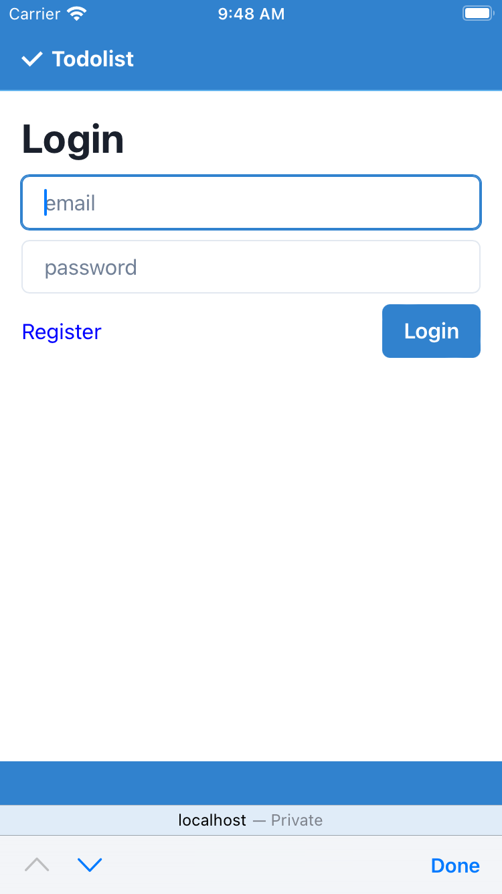
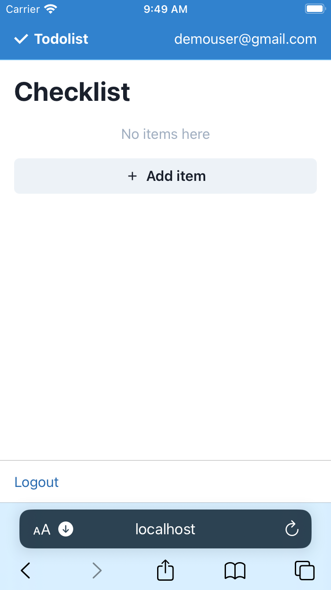
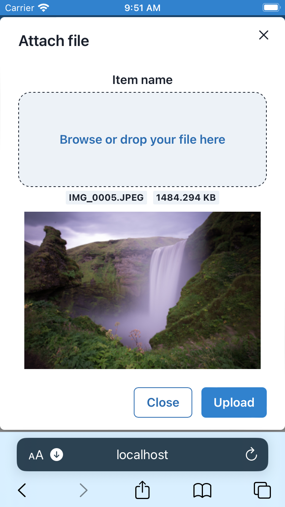

# Admin guide

See also: [user guide](https://github.com/handshou/todolist/blob/main/README.md)

https://github.com/handshou/todolist/assets/12982599/24213dc6-dce6-4f43-a787-efd1554690b4

## Table of contents

1. [Overview](#overview)
   - [Get started](#getting-started)
   - [Limitations](#limitations)
   - [System architecture](#system-architecture)
   - [File structure](#file-structure)
1. [Requirements](#requirements)
1. [Installation](#installation)
   - [Environment configuration](#environment-configuration)
   - [Setting up firebase](#setting-up-firebase)
   - [Running locally](#running-locally)
1. [Deployment](#deployment)
   - [Firebase hosting](#firebase-hosting)
1. [Tips and best practices](#tips-and-best-practices)
   - [Security](#security)
   - [Backup and recovery](#backup-and-recovery)
   - [Monitoring](#monitoring)
   - [User access management](#user-access-management)
   - [Storage access management](#storage-access-management)
   - [Database management](#database-management)
1. [Bugs](#bugs)
1. [Suggestions](#suggestions)
1. [Release notes](#release-notes)
1. [Glossary](#glossary)
1. [Support](#support)

## Overview

You can find this document [online](https://github.com/handshou/todolist/blob/main/README%20ADMIN.md).

- [Get started](#getting-started)
- [Limitations](#limitations)
- [System](#system-architecture)
- [Files](#file-structure)

### Getting started

> You may require experience with a command line interface, in this section.

> You are required to have a Firebase project for Auth, Database, Storage. See: [create Firebase project](https://console.firebase.google.com/u/0/project).

1. Download zipped codes
1. Extract zip file contents
1. Enter directory, name depending on version number. (e.g. `cd todolist-v1.1.0`)
1. Install modules, `npm install` (requires [nodejs](https://nodejs.org/en))
1. Make copy of environment variables, `cp .env.example .env`
1. See [Firebase guide](#https://support.google.com/firebase/answer/7015592?hl=en#zippy=%2Cin-this-article) for environment variables
1. Start local environment, `npm run start`


### Limitations

See: [bugs](#bugs)

Note: Add limitations.

### System architecture

[See other diagram](#admin-overview)


\* glancing from left to right

*Firebase database* **(b)** interacts with *Context API* **(f)**\*

*React router* **(e)** interacts with *Firebase auth* **(c)**\*

| Name           | Tech            | Part |
| ---            | ---             | ---  |
| Hosting | firebase/hosting | a |
| Database | firebase/firestore | b |
| Auth | firebase/auth | c |
| Storage | firebase/storage | d |
| React Router | react-router-dom | e |
| Context API | react/context | f |

---

#### Router architecture

| Route  | Logged in |  Redirect |
| --     | --        |  --       |
| /       | Y | /login        |
|         | N | /login        |
| /login, /register  | Y | /app/todolist |
|         | N | N             |
| /app    | Y | /app/todolist |
|         | N | /login        |
| /app/todolist | Y | N |
| /app/todolist | N | /login |

`/app` route requires authentication to access, hence, is protected.
Without authentication, a user can only access `/login` or `/register`. As long as user is **authenticated**, the user can access *all* features, hence is **authorized** to *all* features: 
- Logout
- Checklist item
   - Create/edit/delete
- File on Checklist item
   - Attach/download

> *Attach* and *upload* are used interchangeably.

---

#### Context architecture

```javascript
# File: src/context/MyProviders.jsx

...

return (
   <>
      <AuthContext.Provider value={...}>
         <DatabaseContext.Provider value={...}>
            <StoreContext.Provider value={...}>
               {children}
            </StoreContext.Provider>
         </DatabaseContext.Provider>
      </AuthContext.Provider>
   </>
);
```

Note: Add values.

| Context name | Value |
| -            | -           |
| Auth         |             |
| Database     |             |
| Store        |             |

---

#### Component architecture: `<App />`


Note: Add description.

---

#### Component architecture: `<Modal />`


Note: Add description.

---

#### Header

Note: Add header.

<p float="left">
   
   
   
</p>

Note: Add description.

<p float="left">
   
   
   
</p>

Note: Add description.

---

### File structure

```
Todolist
├── README ADMIN.md              // Admin guide
├── README.md                    // User guide
├── build                        // Generated files (npm run build)
│   └── ...
├── cors.json
├── firebase.json
├── package-lock.json
├── package.json
├── public                       // Serve static content in this folder
│   ├── 404.html
│   ├── favicon.ico
│   └── index.html
└── src
    ├── components
    │   ├── CredentialsForm.jsx
    │   ├── Dropzone.jsx
    │   ├── EditInputField.jsx
    │   ├── FileModal.jsx
    │   ├── LogoutFooter.jsx
    │   ├── Navbar.jsx
    │   └── TodoModal.jsx
    ├── context
    │   └── MyProviders.jsx
    ├── index.css
    ├── index.js
    ├── routes
    │   ├── app.jsx
    │   ├── login.jsx
    │   ├── protected.jsx
    │   ├── register.jsx
    │   └── todolist.jsx
    ├── setupTests.js            // Leftover test init from create-react-app
    └── utils
        └── auth
            ├── createUser.js
            └── signIn.js
```


#### Single page application

Created using create-react-app. Routing done with React Router v6.14 (createBrowserRouter).

#### Authentication & Authorization

Firebase-Auth (email and password over HTTPS). All authenticated and registered users have full access/authorization to the app.

#### Database

Firestore, snapshot listener hooked up to React Context (works well with Firebase-Auth, read and write permissions).

#### Designed components

[Chakra-ui](https://chakra-ui.com), using some UX principles on good table design practices for the checklist. [React-icons](https://react-icons.github.io/react-icons/search?q=external) for icons.

#### Storage

Firebase storage (interacts nicely with Firebase-Auth, read and write permissions).

#### Key functions and associated files

| Function | File           | Description |
| -------- | -------------- | ----------- |
| `func()` | `src/func.jsx` | Functions   |

## Requirements

VSCode

Terminal

gsutils & python3 installed

## Installation

### Environment configuration

### Setting up firebase

### Running locally

`Firebase emulator`

## Deployment

`Firebase hosting`

## Tips and best practices

### Security

Saving information to local storage

Suggestion to use `Iron session`

### Backup and recovery

`How to make a copy of json data`

`How to make a copy of storage`

### Monitoring

`Firebase dashboard`

### User access management

`Auth`

### Storage access management

`Firestore / Storage`

### Database management

## Bugs

[Back to limitations](#limitations)

## Suggestions

## Release notes

## Glossary

### Admin overview

[Go back - See other diagram](#system-architecture)


### Notes on Create React App

```
## Learn More

You can learn more in the [Create React App documentation](https://facebook.github.io/create-react-app/docs/getting-started).

To learn React, check out the [React documentation](https://reactjs.org/).

### Code Splitting

This section has moved here: [https://facebook.github.io/create-react-app/docs/code-splitting](https://facebook.github.io/create-react-app/docs/code-splitting)

### Analyzing the Bundle Size

This section has moved here: [https://facebook.github.io/create-react-app/docs/analyzing-the-bundle-size](https://facebook.github.io/create-react-app/docs/analyzing-the-bundle-size)

### Making a Progressive Web App

This section has moved here: [https://facebook.github.io/create-react-app/docs/making-a-progressive-web-app](https://facebook.github.io/create-react-app/docs/making-a-progressive-web-app)

### Advanced Configuration

This section has moved here: [https://facebook.github.io/create-react-app/docs/advanced-configuration](https://facebook.github.io/create-react-app/docs/advanced-configuration)

### Deployment

This section has moved here: [https://facebook.github.io/create-react-app/docs/deployment](https://facebook.github.io/create-react-app/docs/deployment)

### `npm run build` fails to minify

This section has moved here: [https://facebook.github.io/create-react-app/docs/troubleshooting#npm-run-build-fails-to-minify](https://facebook.github.io/create-react-app/docs/troubleshooting#npm-run-build-fails-to-minify)
```

## Support

Contact me on Github or open an issue [here](https://github.com/handshou/todolist/issues).

[To top](#table-of-contents)
