# User guide

See also: [admin guide](https://github.com/handshou/todolist/blob/main/README%20ADMIN.md)

Live demo link: [Here @ https://todolist-hansel.web.app](https://todolist-hansel.web.app)

### Quick video guide (No audio)

Or jump right in [here](#features-how-to)!

https://github.com/handshou/todolist/assets/12982599/24213dc6-dce6-4f43-a787-efd1554690b4

## Table of contents

1. [Overview](#overview)
    - [Changes](#latest-changes)
    - [Interface](#interface)
    - [Account management](#account-management)
1. [Getting started](#getting-started)
   - [Online](#online)
   - [Offline, local](#offline-local)
1. [Features (How-to)](#features-how-to)
   - [Register](#register)
   - [Login, logout](#login-logout)
   - [Create, delete task](#create-delete-task)
   - [Attach, view, download file](#attach-view-download-file)
1. [Troubleshooting](#troubleshooting)
   - [Register troubleshooting](#register-troubleshooting)
   - [Login troubleshooting](#login-troubleshooting)
1. [Support](#support)

## Overview

You can find this document online at .

### Latest changes

Updates about the development process.

| Task | Date |
| ---- | ---- |
| **During technical interview**                      |
| Create-react-app, React-router, Chakra UI  | 26 Jul |
| **After technical interview**                       |
| Style UI, todolist, login, logout          | 26 Jul |
| Create navbar, footer                      |       |
| Add auth, modal, additional items, validation, protected routes | 27 Jul |
| Add storage, firebase emulator (offline dev database)           | 28 Jul |
|Host live demo, add file upload, add file download, Context API  | 29 Jul |
| Add .env.example, Use react-dropzone                            |        |
| Complete upload/download                                        | 31 Jul |
|Add Doc Renderer, Update CORS, Add Badges for filename and filesize|1 Aug |
|Documentation                                                    |  2 Aug |

> Further updates may be found in Git history.

[Back to table of contents](#table-of-contents)

### Interface

A showcase of the user interface on an iPhone SE 3, Safari browser.

---

#### Login, logout

   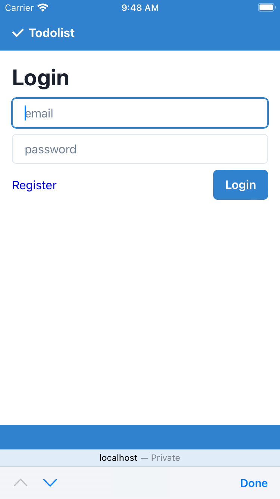
   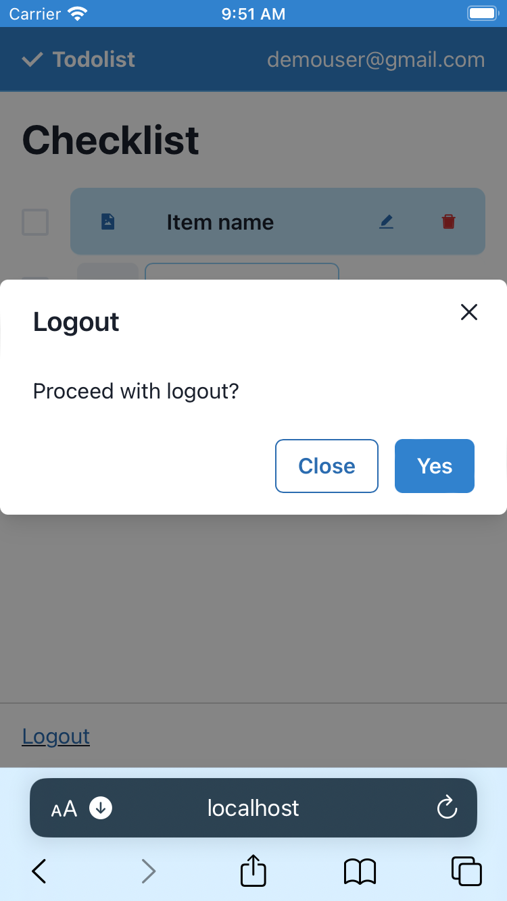

---

#### Checklist

   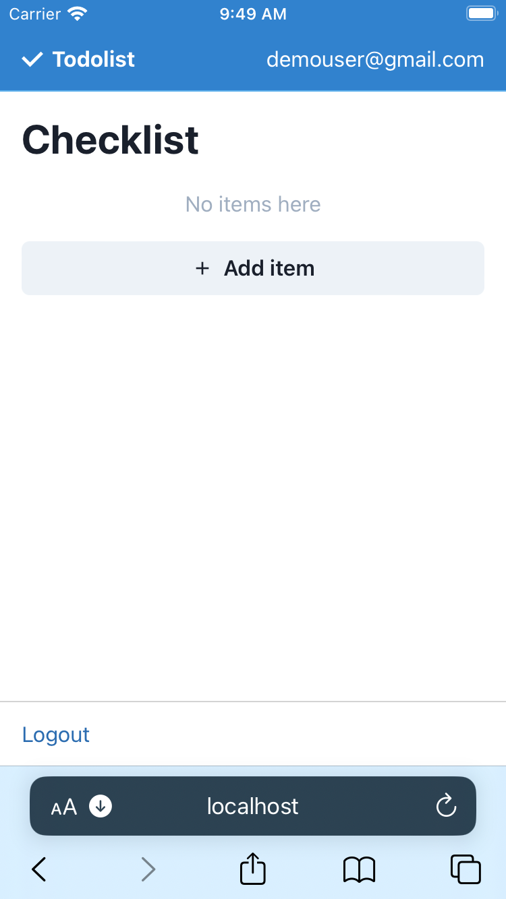
   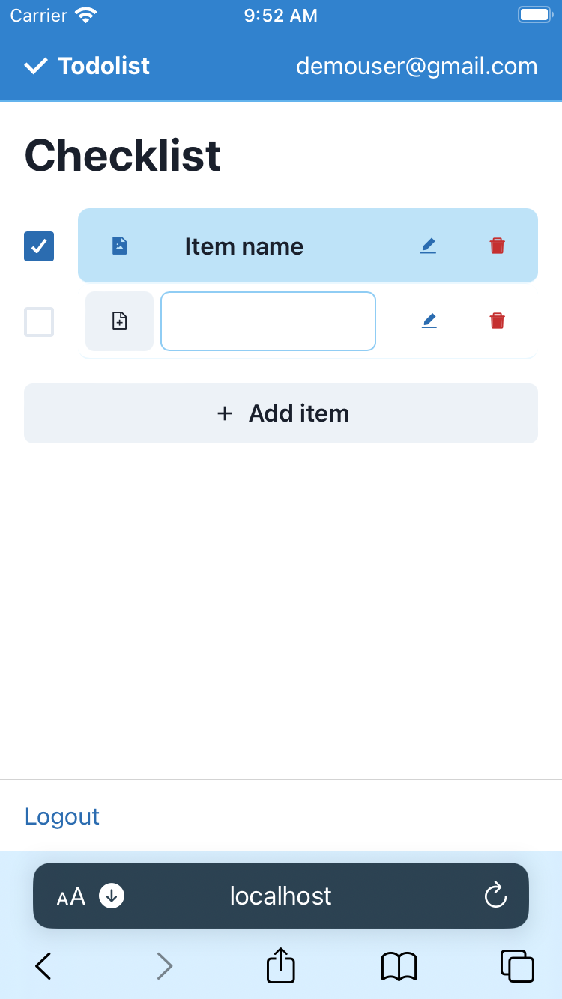

---

#### Attach file before upload

   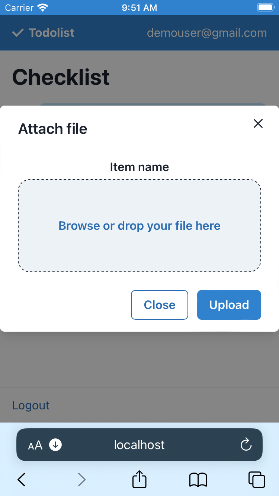
   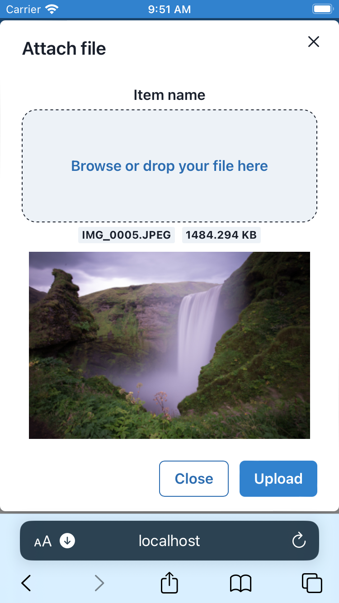

---

#### View uploaded file
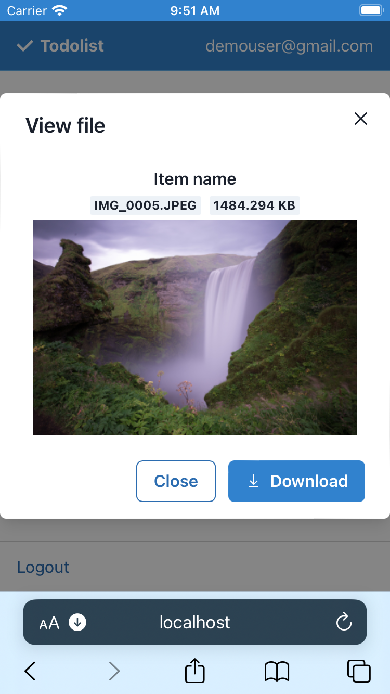

---

#### Delete an item (and attached file)
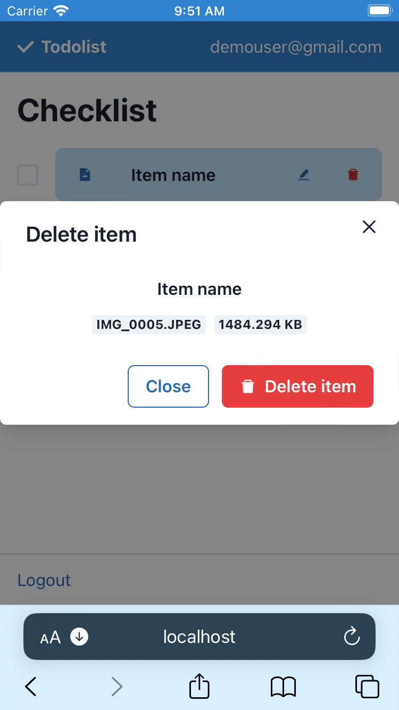

---

[Back to table of contents](#table-of-contents)

### Account management

> Account data is managed by *Firebase-Auth* microservice. 
> Password recovery and email verification can be added features.

*Login tokens* are **received** after exchanging (*email*, *password*) via **HTTPS** to **Firebase-Auth**.

They are **stored** in your browser session (localstorage).

**Cleared** on logout.

[Back to table of contents](#table-of-contents)

## Getting started

### Online

It is recommended to try out the live demo @ https://todolist-hansel.web.app

### Local

> You may require experience with a command line interface, in this section.

> You are required to have a Firebase project for Auth, Database, Storage. See: [create Firebase project](https://console.firebase.google.com/u/0/project).

1. Download zipped codes
1. Extract zip file contents
1. Enter directory, name depending on version number. (e.g. `cd todolist-v1.1.0`)
1. Install modules, `npm install` (requires [nodejs](https://nodejs.org/en))
1. Make copy of environment variables, `cp .env.example .env`
1. See [Firebase guide](#https://support.google.com/firebase/answer/7015592?hl=en#zippy=%2Cin-this-article) for environment variables
1. Start local environment, `npm run start`

[Back to table of contents](#table-of-contents)

## Features (How-to)

A full video (no audio) is available to preview the same features, [here](#quick-video-guide-no-audio).

Or dive right in!

---

### Beginning 

> Start here. Select one of the following. 
>
> *Online* (recommended)
>
> [`https://todolist-hansel.web.app/login`](`https://todolist-hansel.web.app/login` ) 
>
> *Local*
>
> `localhost:3000/login`

---

### Login, logout

> See [Register](#register), if you do not have a registered account.

1. Enter a registered email and password.

1. Tap login button.

> Unregistered emails will be prompted to register an account.

> Password must have 6 characters, minimum.

---

### Register

> You will be signed in automatically with successful registration.
> 
> Navigate to Register screen by tapping on Register link on the login page.

1. Enter an email and password.

1. Tap register button.

> Email has to be new on application, newly-registered.

> Password must have 6 characters, minimum.

---

### Create, delete task

> Ensure you are logged in, an email will appear on right of Navbar

1. Scroll to bottom.
1. Tap on new task button.
1. Tap on empty input field.
1. Enter task name.
1. To delete task, tap on Delete icon.
1. Confirm by tapping "Delete" on pop up.

---

### Attach, view, download file

> If a file has been uploaded to an item, you cannot attach a new file to the *same* item.
>
> In this case, create a new task to attach a new file.

1. Tap on file button on the left of item name.
1. If no files are attached, tap and browse, or drag and drop a file.
1. Preview the attached file.
1. Tap on upload, or download button.

---

[Back to table of contents](#table-of-contents)

## Troubleshooting

Possible errors you may encounter and the steps to resolve these issues.

Did not find an issue you are facing? [File an issue](https://github.com/handshou/todolist/issues).

---

### Register troubleshooting

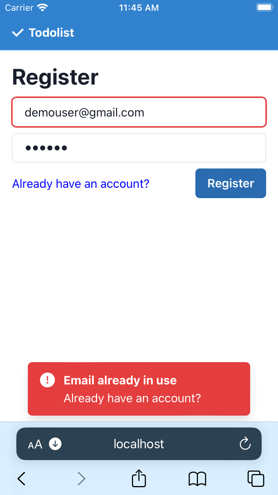

Someone else may have registered your email. 

There is an existing email registered on the application. To resolve issues on forgetting passwords, or verifying emails... contribute by [filing an issue](https://github.com/handshou/todolist/issues) or [creating a pull request](https://github.com/handshou/todolist/pulls).

Or [contact me](https://github.com/handshou) on Github.

---

### Login troubleshooting

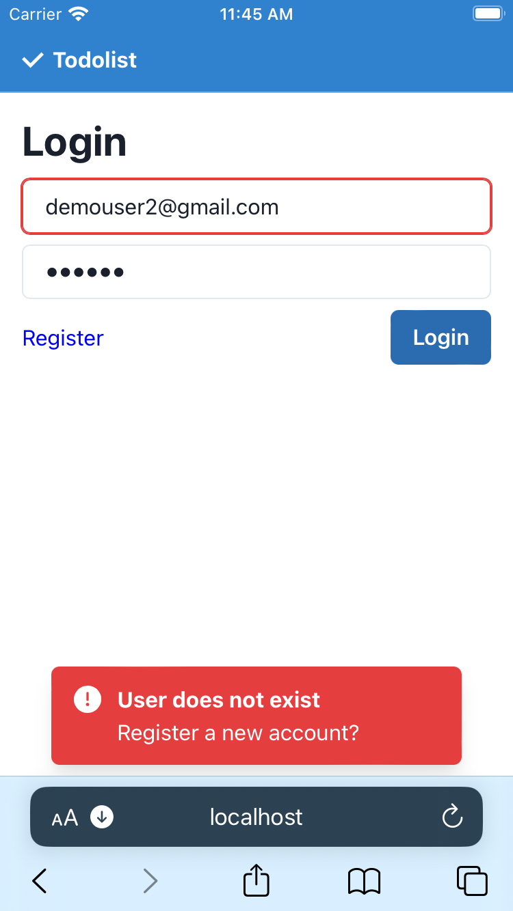

> The email has not been used to create an account. 

Proceed to register a new account.

1. Tap blue link, Register
1. Sign up with an email and password.
1. Tap register button.
1. You should be logged in automatically, re-use the credentials on your next login.

[Back to table of contents](#table-of-contents)

---

### File not found

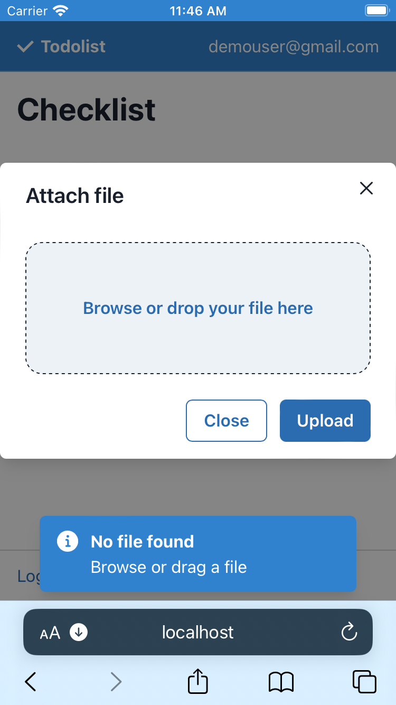

No files have been selected.

1. Tap blue area "Browse or drop your file here".
1. Alternatively, drag a file into blue area.
1. See a preview of the file, below the blue area.
1. Tap upload button.

[Back to table of contents](#table-of-contents)

---

### Page not found

Not included in this release.

[Back to table of contents](#table-of-contents)

## Support

Contact me on Github or open an issue [here](https://github.com/handshou/todolist/issues).

[Back to table of contents](#table-of-contents)
